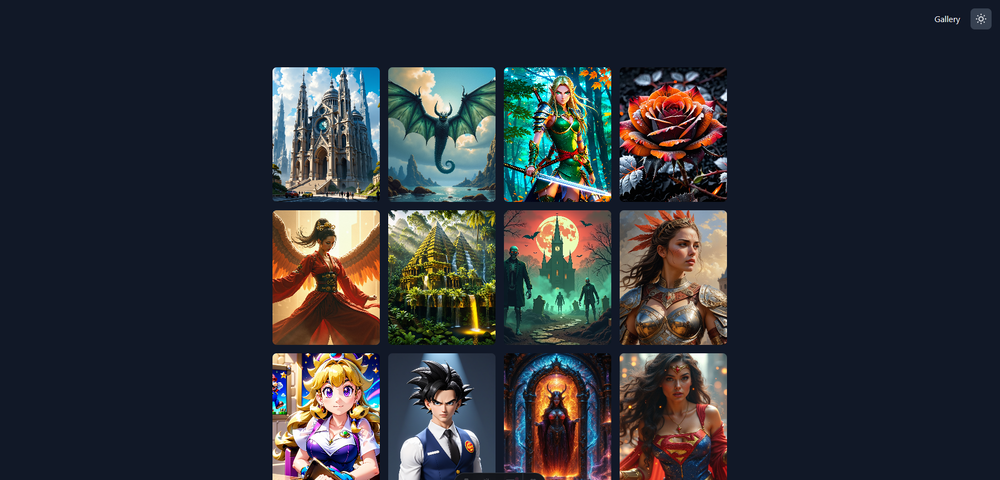

# Image Gallery with Cloudinary

A modern web application built with Astro and Cloudinary for managing and displaying images. Features dark/light theme support and drag-and-drop image uploads.



## 🚀 Features

- Image gallery with responsive grid layout
- Drag-and-drop file upload interface
- Dark/light theme support with system preference detection
- Cloudinary integration for image storage and optimization
- TypeScript support for improved development experience

## 🛠️ Tech Stack

- [Astro](https://astro.build/) - Web framework
- [Tailwind CSS](https://tailwindcss.com/) - Styling
- [Cloudinary](https://cloudinary.com/) - Image storage and optimization
- TypeScript - Type safety and development experience

## 📦 Project Structure

```
/
├── src/
│   ├── components/
│   │   ├── DropZone.astro
│   │   ├── GalleryImage.astro
│   │   └── ThemeToggle.astro
│   ├── layouts/
│   │   └── Layout.astro
│   ├── libs/
│   │   ├── dropZone.ts
│   │   ├── fileHandlers.ts
│   │   └── imagePreview.ts
│   ├── pages/
│   │   ├── index.astro
│   │   └── upload.astro
│   └── types/
│       ├── image.ts
│       └── uploadResult.ts
└── public/
```

## 🔧 Setup

1. Install dependencies:

```bash
npm install
```

2. Configure environment variables:

```env
CLOUDINARY_CLOUDNAME=your_cloud_name
CLOUDINARY_APIKEY=your_api_key
CLOUDINARY_APISECRET=your_api_secret
```

3. Run development server:

```bash
npm run dev
```

## 📝 Usage

1. Access the gallery at the root URL (`/`)
2. Upload images via the upload page (`/upload`)
   - Drag and drop images or click to select files
   - Support for multiple image upload
   - Directory upload support
3. Toggle between dark/light themes using the theme button

## 🏗️ Build

Build for production:

```bash
npm run build
```

Preview production build:

```bash
npm run preview
```

## 📄 API Endpoints

- `GET /api/search` - Retrieve gallery images
- `POST /api/upload` - Upload new images to Cloudinary

## 🔑 Key Components

- `DropZone` - Handles file upload interface and image preview
- `GalleryImage` - Displays uploaded images in a responsive grid
- `ThemeToggle` - Manages theme switching functionality
